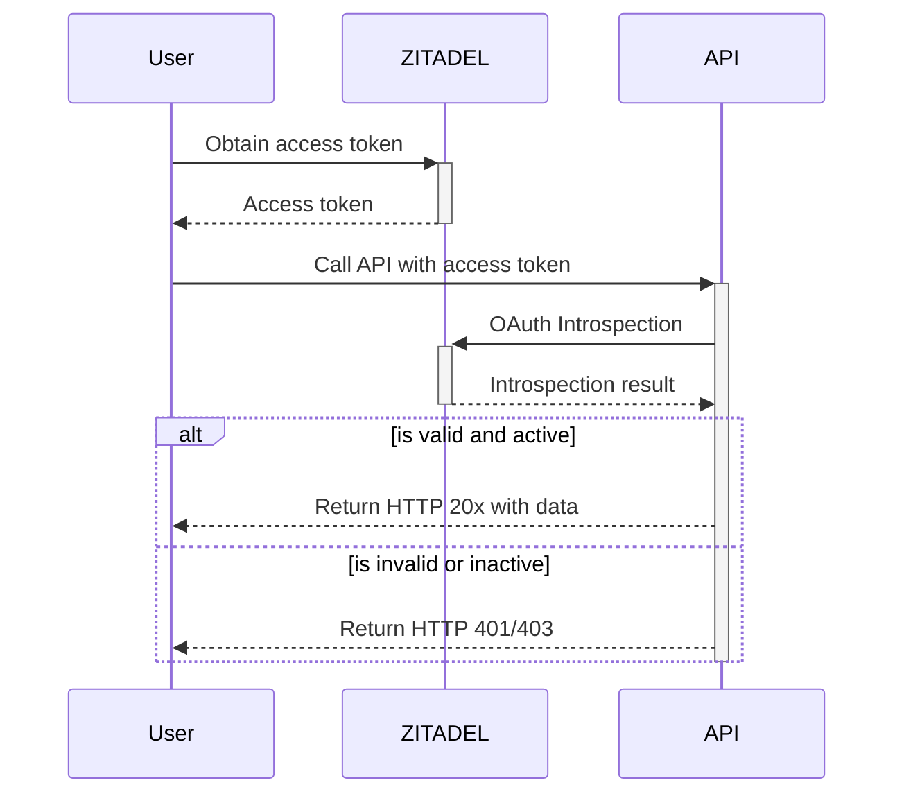

# Passport for ZITADEL

This package contains [passport js](http://www.passportjs.org/)
strategies for ZITADEL (v2).

As a prerequisite, similar to Google OAuth, you need to create
a project and an application in ZITADEL.

## Create ZITADEL instance and requirements

Head over to [zitadel.cloud](https://zitadel.cloud) and login or create
a new account in the customer portal of ZITADEL. Then, you can create
a new instance (either free or "pay as you go"). In this new instance,
you can create a new project and inside it a new application.

## Strategies

This section describes the provided strategies in this package. It
is subject to change in the future if more and more strategies are
needed.

### ZITADEL API Introspection

First and foremost, the introspection strategy allows APIs to
verify and validate an access token.

The strategy is based on the
[OAuth 2.0 Token Introspection (RFC 7662)](https://tools.ietf.org/html/rfc7662)
and checks if the provided access token (`HTTP Authorization` header)
is valid and active.

The strategy requires an "API Project" in ZITADEL, which is either
configured with "Basic" or "JWT Profile" as authentication method.
Both variants are supported in the strategy. The JWT profile variant
is recommended.

The diagram below explains the introspection workflow:



#### Example JWT Profile

Note: To get the JWT profile json file, you can create a valid
application key in the API application in ZITADEL and download it.

```typescript
import express from 'express';
import path from 'path';
import passport from 'passport';
import { ZitadelIntrospectionStrategy } from 'passport-zitadel';

const app = express();
const port = 8080;

// Register the strategy with the correct configuration.
passport.use(
  new ZitadelIntrospectionStrategy({
    authority: 'https://YOUR_ZITADEL_INSTANCE_NAME.zitadel.cloud',
    authorization: {
      type: 'jwt-profile',
      profile: {
        type: 'application',
        keyId: 'key id',
        key: 'private rsa key',
        appId: 'app id',
        clientId: 'client id',
      },
    },
  })
);

app.use(passport.initialize());

app.use(passport.authenticate('zitadel-introspection', { session: false }));
app.get('/', (req, res) => {
  res.send('Hello World!');
});

app.listen(port, () => {
  console.log(`server started at http://localhost:${port}`);
});
```

#### Example Basic

```typescript
import express from 'express';
import path from 'path';
import passport from 'passport';
import { ZitadelIntrospectionStrategy } from 'passport-zitadel';

const app = express();
const port = 8080;

// Register the strategy with the correct configuration.
passport.use(
  new ZitadelIntrospectionStrategy({
    authority: 'https://YOUR_ZITADEL_INSTANCE_NAME.zitadel.cloud',
    authorization: {
      type: 'basic',
      clientId: 'CLIENT ID',
      clientSecret: 'CLIENT SECRET',
    },
  })
);

app.use(passport.initialize());

app.use(passport.authenticate('zitadel-introspection', { session: false }));
app.get('/', (req, res) => {
  res.send('Hello World!');
});

app.listen(port, () => {
  console.log(`server started at http://localhost:${port}`);
});
```
